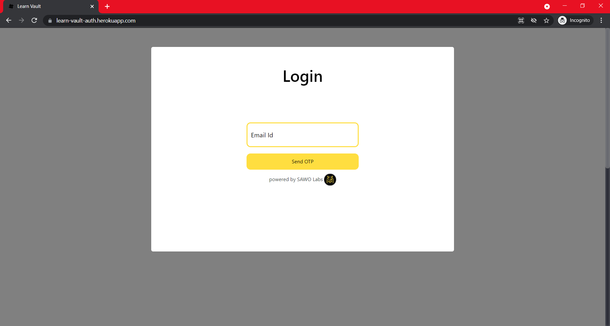
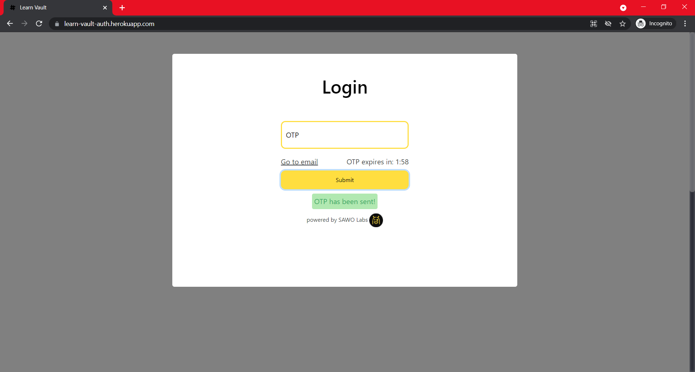
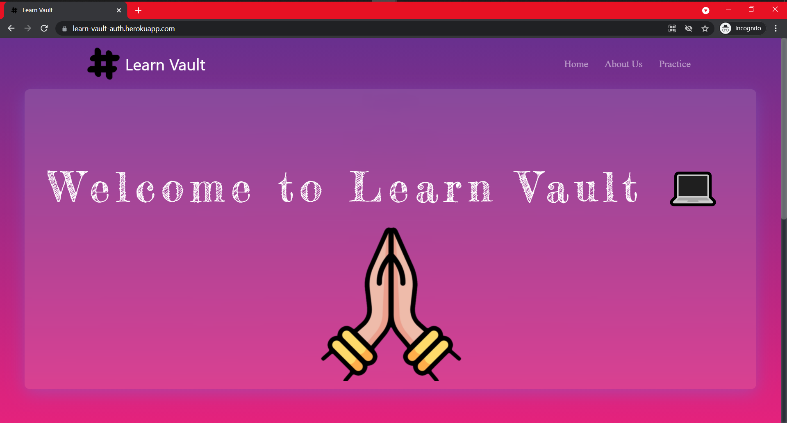
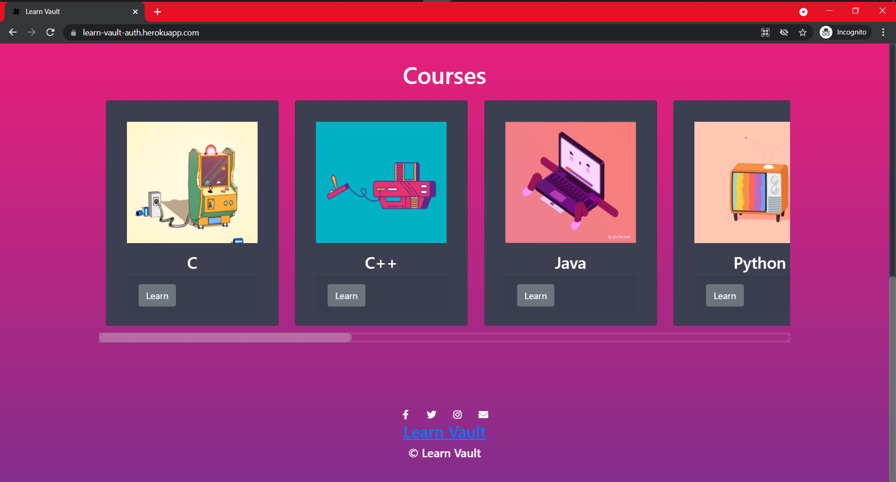
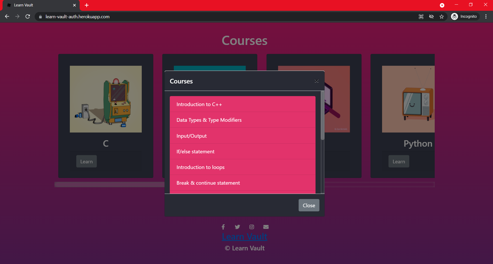

    
    <h2 align="center">Discover best courses for the best  learning</h2>

Visit website : https://learn-vault-auth.herokuapp.com/  

## About the project
We got the inspiration of this idea with the help of our fellow friends who wanted to have good knowledge as well as relevant skills in different **Programming languages** and **frameworks**. They wanted a single platform to access the **best resources** available in the internet, so we came up with an idea to build this platform.

**Learn Vault** is a web and app based platform where the we provide the **best-handpicked courses** from the internet at one place of different branches. Students who will use the platform can view **various courses** and test their knowledge.

## Web stack
- HTML
- CSS
- JAVASCRIPT

## Installation
**You need to do changes only in `develop` branch** 
(Make sure you have **Node/Nodemon** & **Express** installed)
1. Fork this repo
2. Clone the forked repo
3. Open the main/parent `learn-vault` folder
4. Run the following command inside `learn-vault`'s terminal:
    - `node app.js` -> if you have **Node**
    - `nodemon app.js` -> if you have **Nodemon**
    - You'll get a port_number
5. Open any browser, in new tab enter a url `https://localhost:<port_number>/` like `http://localhost:3000/`

## Project Visual

Login  Screen
 

Login OTP Screen

 

Main page of the project

 

Courses outlook

 

Page view of courses content

 

#### Thank You!🥇